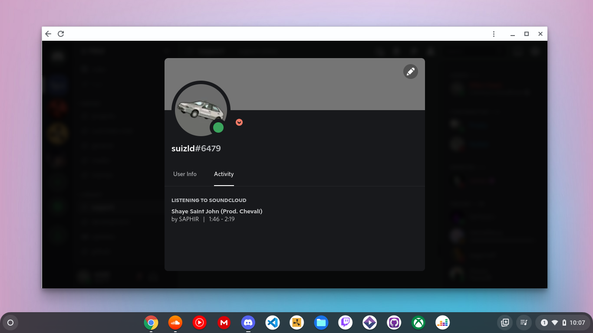
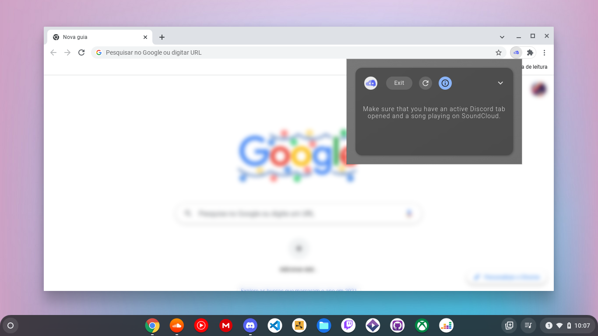

  

***

A simple Chrome extension that aims to provide Rich Presence for SoundCloud on the web version of Discord. 

    * Easy to use.
    * Aimed towards ChromeOS users.
    * Works on any operating system that runs Chrome or Chromium based browsers.
  

todo list:

-   ~~better extension UI~~ _(something closer to ChromeOS design)_ :white_check_mark:
-   implement redux
-   faster song progress display _(timer)_
-   stealth mode _(when enabled the extension will not display the current song/author being played)_
-   cover art _(maybe)_

:construction: more to come...

  
Here is some images of the extension:

If you find bugs or glitches feel free to let me know. 
If you want to contribute, you can always make a pull request.
